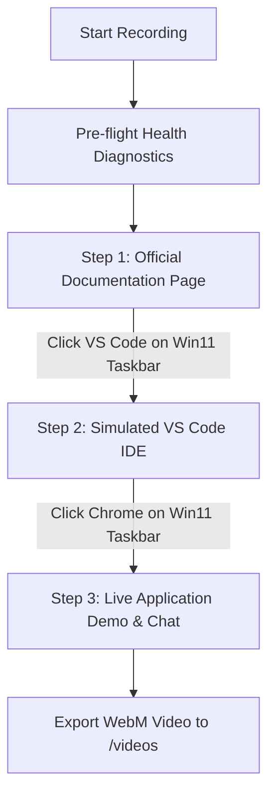

# Autorecord Suite: Improvements, Fixes & Porting Guide

> **Master Reference Document for AI Agents & Developers**  
> Use this document as the single source of truth when maintaining, improving, or porting the `autorecord/` automated video recording suite across repositories (CopilotKit, Agno, Angular, React, Next.js, LangGraph, FastAPI, etc.).

---

## 📑 Table of Contents
1. [Core Architecture & 3-Step Recording Lifecycle](#1-core-architecture--3-step-recording-lifecycle)
2. [Complete Inventory of Improvements & Fixes](#2-complete-inventory-of-improvements--fixes)
   - [Fix 1: Eliminating Local OS Desktop Application Launches](#fix-1-eliminating-local-os-desktop-application-launches)
   - [Fix 2: Eliminating Doc Page / White Screen Transition Flash](#fix-2-eliminating-doc-page--white-screen-transition-flash)
   - [Fix 3: Authentic VS Code Dark+ Simulation & Multi-Tab Tab Switching](#fix-3-authentic-vs-code-dark-simulation--multi-tab-tab-switching)
   - [Fix 4: Practiced Human Cursor Motion & Snappy Pacing](#fix-4-practiced-human-cursor-motion--snappy-pacing)
   - [Fix 5: Real-Time Token Stream Completion Detection & Dual Pacing Policy](#fix-5-real-time-token-stream-completion-detection--dual-pacing-policy)
   - [Fix 6: Two-Phase Deep Doc Scrolling & In-Viewport VS Code Code Scrolling](#fix-6-two-phase-deep-doc-scrolling--in-viewport-vs-code-code-scrolling)
   - [Fix 7: Dynamic Viewport-Relative Taskbar & Notepad Coordinates](#fix-7-dynamic-viewport-relative-taskbar--notepad-coordinates)
   - [Fix 8: Browser Console, Network & Hydration Warning Filtering](#fix-8-browser-console-network--hydration-warning-filtering)
9. [Fix 9: Guaranteed Error Propagation & Non-Swallowing Cleanup](#fix-9-guaranteed-error-propagation--non-swallowing-cleanup)
10. [Fix 10: Multi-Turn Stream Completion Race Elimination](#fix-10-multi-turn-stream-completion-race-elimination)
11. [Fix 11: Declarative Multi-Tab IDE Architecture](#fix-11-declarative-multi-tab-ide-architecture)
12. [Fix 12: Single-IPC Practiced TypingCadence](#fix-12-single-ipc-practiced-typing-cadence)
13. [Fix 13: Full TSX/HTML Syntax Highlighting & Dynamic Workspace Title](#fix-13-full-tsxhtml-syntax-highlighting--dynamic-workspace-title)
14. [Fix 14: Extended CLI Toolkit & Elapsed Duration Metrics](#fix-14-extended-cli-toolkit--elapsed-duration-metrics)
15. [Fix 15: Environment-Configurable Service Diagnostics](#fix-15-environment-configurable-service-diagnostics)
3. [Repository File Map & Responsibilities](#3-repository-file-map--responsibilities)
4. [Step-by-Step Guide for Porting to Other Repositories](#4-step-by-step-guide-for-porting-to-other-repositories)

---

## 1. Core Architecture & 3-Step Recording Lifecycle

Every automated documentation video follows a standardized 3-step sequence orchestrated by `RecordingEngine` in [`recorder/engine.ts`](file:///c:/Users/dynamic%20computer/Desktop/work/FIQROS/optimized-malaika/mspy/CPK-MS-Agent-Python/autorecord/recorder/engine.ts):



### The 3 Steps:
1. **Step 1 — Official Documentation Page:**
   - Navigates immediately using `domcontentloaded` to eliminate remote asset wait times.
   - Pauses for **500ms** so the viewer sees the page title and header.
   - Smoothly scrolls down Phase 1 (800px) and continues Phase 2 (950px) down to the primary code block (`main.py` / component).
   - Dynamically identifies the visible code block on screen, glides the virtual cursor over it, and pauses for **2.0s**.
   - Glides cursor to the Windows 11 Taskbar, clicks the VS Code icon, and illuminates the taskbar indicator.

2. **Step 2 — High-Fidelity Standalone Simulated VS Code IDE:**
   - Renders a pure HTML/CSS VS Code Dark+ simulator with Windows 11 window launch animation.
   - Supports declarative multi-tab rendering (e.g. `package.json` $\rightarrow$ `page.tsx`).
   - Automatically centers `.code-viewport` on the active snippet lines.
   - For multi-tab files: Virtual cursor glides up to the tab bar, clicks the next tab, switches the editor view in place, and highlights project code.
   - Glides cursor down to the Windows 11 Taskbar, clicks the Chrome icon, and illuminates the taskbar indicator.

3. **Step 3 — Live Application Demo & Interaction:**
   - Smoothly navigates to the local application demo (`config.demoUrl`) with zero flicker.
   - Waits for React/Angular hydration and chat component readiness.
   - Dispatches the tailored action handler (`recorder/actions/*.action.ts`).
   - Types user prompt with snappy 35ms human keystrokes in a single IPC call.
   - Actively detects token streaming in real-time until generation stabilizes.
   - Focuses cursor on the completed response and holds for a **4.0s reading pause** (or **1.5s** between multi-turn tabs).
   - Finalizes and saves the WebM video.

---

## 2. Complete Inventory of Improvements & Fixes

### Fix 1: Eliminating Local OS Desktop Application Launches
* **Problem:** In earlier versions, `engine.ts` executed `exec('code -r -g ...')`, which launched or focused the actual desktop VS Code application on the developer's computer during recording runs.
* **Solution:** Completely remove all `exec('code ...')` and `child_process` execution. Step 2 relies 100% on the internal standalone simulated VS Code IDE in Chromium.

---

### Fix 2: Eliminating Doc Page / White Screen Transition Flash
* **Problem:** Navigating from the external doc URL to `http://localhost:3000/...` causes the browser to unload the DOM and momentarily flash previous content or a white canvas while the local server renders.
* **Solution:** Prior to `page.goto(config.demoUrl)`, apply an instant dark background shield (`document.body.style.backgroundColor = '#0f172a'`) and navigate with `waitUntil: 'domcontentloaded'`.

---

### Fix 3: Authentic VS Code Dark+ Simulation & Multi-Tab Tab Switching
* **Problem:** 
  1. The IDE previously looked like a flat, generic text box without authentic VS Code styling.
  2. Displaying multiple files (e.g. `package.json` then `page.tsx`) replaced the entire window DOM in an abrupt jarring cut.
* **Solution in [`recorder/ide/generator.ts`](file:///c:/Users/dynamic%20computer/Desktop/work/FIQROS/optimized-malaika/mspy/CPK-MS-Agent-Python/autorecord/recorder/ide/generator.ts):**
  - **VS Code Dark+ Tokens:** Implemented placeholder-protected syntax highlighter for TSX/TS, Python, JSON, and Markdown (keywords `#569cd6`, strings `#ce9178`, comments `#6a9955`, types `#4ec9b0`, functions `#dcdcaa`, and numbers `#b5cea8`).
  - **Authentic UI Elements:** Added top Command Palette search pill (`Ctrl + P`), menu bar (`File`, `Edit`, etc.), Seti SVG icons, dynamic file tree, blinking line caret (`.vs-caret`), and code minimap.
  - **Multi-Tab Rendering & In-Place Tab Switching:** `generateIdeHtml` supports `extraTabs`. Both files render in the tab bar (`#ide-tab-0`, `#ide-tab-1`). The cursor moves to the tab, clicks it, and smoothly switches the editor viewport without reloading the window.
  - **Windows 11 Window Opening Animation:** Added subtle `win11Open` scale/elevation entrance keyframes.

---

### Fix 4: Practiced Human Cursor Motion & Cross-Navigation Continuity (Zero Teleportation)
* **Problem:** 
  1. The original cursor logic had erratic 30px overshoots, large random jitter ($\pm 1.8\text{px}$), and sluggish 100ms pauses, making motions feel wobbly and unpracticed.
  2. Whenever a new page loaded or VS Code was opened, `ensureOverlays` injected `#playwright-virtual-mouse` with a hardcoded `top: 300px; left: 500px;`, causing the cursor to abruptly snap / teleport back to `(500, 300)` instead of staying on the taskbar icon that was just clicked.
* **Solution in [`recorder/overlays/cursor.ts`](file:///c:/Users/dynamic%20computer/Desktop/work/FIQROS/optimized-malaika/mspy/CPK-MS-Agent-Python/autorecord/recorder/overlays/cursor.ts) & [`taskbar.ts`](file:///c:/Users/dynamic%20computer/Desktop/work/FIQROS/optimized-malaika/mspy/CPK-MS-Agent-Python/autorecord/recorder/overlays/taskbar.ts):**
  - **Persistent Coordinate State:** `cursor.ts` maintains `globalCursorX` and `globalCursorY` continuously updated across the entire test run via `getGlobalCursorPos()` / `setGlobalCursorPos()`.
  - **Zero Teleportation on Navigation:** When `ensureOverlays(page, activeApp)` injects the virtual mouse overlay into any newly loaded page or simulated IDE view, it mounts the cursor element directly at `${curY}px, ${curX}px` (the exact location of the taskbar icon just clicked).
  - **Seamless Starting Trajectory:** When the next `humanGlide(page, targetX, targetY)` runs, the mouse glides naturally and continuously from the taskbar icon up into the editor or chat input.
  - **Natural Cubic Bézier Arcs:** Single fluid curve with natural hand curvature ($cp1, cp2$) without robotic straight lines or artificial overshoots.
  - **Dense 60fps Event Emission:** 10ms–14ms frame delays with continuous coordinate streaming.
  - **Variable Dynamic Velocity:** Fast initial acceleration $\rightarrow$ fluid momentum $\rightarrow$ subtle target ease-out ($t = 1 - (1-t)^{2.5}$).
  - **Snappy Mechanics:** 30ms pre-click, 55ms mouse-down depression, 40ms mouse-up release, and 35ms typing cadence.

---

### Fix 5: Real-Time Token Stream Completion Detection & Dual Pacing Policy
* **Problem:** Actions previously relied on arbitrary static sleeps (`sleep(4000)`, `sleep(6500)`), causing recordings to either cut off streaming responses prematurely or wait too long, especially during multi-tab demos.
* **Solution in [`recorder/actions/index.ts`](file:///c:/Users/dynamic%20computer/Desktop/work/FIQROS/optimized-malaika/mspy/CPK-MS-Agent-Python/autorecord/recorder/actions/index.ts) & [`config.ts`](file:///c:/Users/dynamic%20computer/Desktop/work/FIQROS/optimized-malaika/mspy/CPK-MS-Agent-Python/autorecord/recorder/config.ts):**
  - `waitForAgentResponseCompletion(page, postWaitMs, initialCount)` actively polls the assistant message bubble content.
  - Detects stream completion when text length remains constant for 4 consecutive checks (1.6s).
  - Smoothly glides cursor to focus on the assistant response.
  - **Dual Pacing Policy:**
    - **Single-Prompt Pages** (e.g. `quickstart`, `headless-ui`, `display-only`): Standard **4.0-second reading pause** (`postWaitMs = 4000`).
    - **Multi-Tab / Multi-Prompt Pages** (e.g. `slots`, `prebuilt-components`, `runtime`, `programmatic-control`, `inspector`): Fast, energetic **1.5-second pause** (`postWaitMs = 1500`) between tabs/levels to keep video pacing brisk without dead air.

---

### Fix 6: Silky 60fps Continuous Doc Scrolling (~90% Depth) & VS Code Viewport Auto-Centering
* **Problem:** 
  1. Documentation pages previously had jittery stutter because `page.mouse.wheel` and `window.scrollBy({ behavior: 'smooth' })` were fired simultaneously, causing conflicting velocity curves.
  2. In VS Code, when code snippets were below line 25 (e.g. lines 58–104 or 66–116), they were offscreen or jumped abruptly.
* **Solution in [`recorder/overlays/cursor.ts`](file:///c:/Users/dynamic%20computer/Desktop/work/FIQROS/optimized-malaika/mspy/CPK-MS-Agent-Python/autorecord/recorder/overlays/cursor.ts) & [`recorder/engine.ts`](file:///c:/Users/dynamic%20computer/Desktop/work/FIQROS/optimized-malaika/mspy/CPK-MS-Agent-Python/autorecord/recorder/engine.ts):**
  - **Native 60fps RAF Easing:** `humanScrollDown` runs a unified `requestAnimationFrame` loop with smooth cubic ease-in-out easing (`acceleration -> steady glide -> gentle deceleration`), eliminating wheel event conflicts and jitter completely.
  - **~90% Page Depth Coverage:** Automatically computes `scrollHeight` and glides smoothly through ~85-90% of the entire documentation page, revealing full introductions and code examples.
  - **Visible Code Detection:** Dynamically detects the code block currently in the middle of the viewport and hovers the virtual cursor over it for 2.0s.
  - **`humanScrollCodeViewport(page, startLine)`:** For VS Code snippets with `startLine > 14`, the editor viewport smoothly and visibly scrolls down line-by-line over ~700ms using cubic ease-in-out, centering the highlighted block in real-time before the cursor glides across it.

---

### Fix 7: Hyper-Realistic Windows 11 Fluent Taskbar & Dynamic Coordinate Resolution
* **Problem:** The taskbar previously had generic flat styling, basic icons, and hardcoded static coordinates (`1029, 1056`) that missed targets on non-standard viewport scalings.
* **Solution in [`recorder/overlays/taskbar.ts`](file:///c:/Users/dynamic%20computer/Desktop/work/FIQROS/optimized-malaika/mspy/CPK-MS-Agent-Python/autorecord/recorder/overlays/taskbar.ts):**
  - **Acrylic & Mica Blur Material:** Injected taskbar with `background: rgba(28, 28, 32, 0.85)` and `backdrop-filter: blur(36px) saturate(180%)`.
  - **Authentic Fluent Icons:** Vector SVGs for Windows 11 Start, Search, Desktops, Explorer, Chrome, VS Code, Notepad, Terminal, and Copilot.
  - **Active State Highlights & Indicator Pills:** Active app tile displays frosted highlight with a **16px blue pill** (`#60a5fa`).
  - **Dynamic Viewport Bounding Boxes:** Taskbar icon coordinates are computed dynamically from `getBoundingClientRect()`.

---

### Fix 8: Browser Console, Network & Hydration Warning Filtering
* **Problem:** Next.js App Router background prefetch chunks, `.map` source maps, favicon 404s, and React dev hydration differences logged false alarm warnings in the console.
* **Solution in [`recorder/engine.ts`](file:///c:/Users/dynamic%20computer/Desktop/work/FIQROS/optimized-malaika/mspy/CPK-MS-Agent-Python/autorecord/recorder/engine.ts):**
  - Filtered benign 404s, `webpack-hmr`, `favicon.ico`, and hydration mismatch warnings so only genuine runtime breakages are logged.

---

### Fix 9: Guaranteed Error Propagation & Non-Swallowing Cleanup
* **Problem:** `engine.ts` previously returned `{ success: true }` inside a `finally` block, which caused JavaScript to swallow all runtime exceptions and report false positives (`[PASS]`).
* **Solution:** Removed `return` from `finally`, added explicit tracking variables (`recordSuccess`, `recordError`, `finalSavedFilename`), and ensured that failed recordings return `success: false` and cause `record-all-pages.ts` to exit with status code `1`.

---

### Fix 10: Multi-Turn Stream Completion Race Elimination
* **Problem:** In multi-turn action sequences (like `slots` tab 2/3, `runtime` agent switching, or `prebuilt` tabs), `waitForAgentResponseCompletion()` would detect the *previous* turn's assistant message and immediately exit within 1.6s before the new response even began streaming.
* **Solution:** Added `getAssistantMessageCount(page)` and snapshotting support in `waitForAgentResponseCompletion(page, postWaitMs, initialCount)`. The polling loop now verifies that a *new* message element or content update has arrived before entering the stream-stabilization phase.

---

### Fix 11: Declarative Multi-Tab IDE Architecture
* **Problem:** Multi-tab IDE viewing was hardcoded to `if (config.id === 'quickstart')` inside `engine.ts`.
* **Solution:** Moved `extraTabs?: IdeTabConfig[]` to `PageRecordConfig` in [`recorder/types.ts`](file:///c:/Users/dynamic%20computer/Desktop/work/FIQROS/optimized-malaika/mspy/CPK-MS-Agent-Python/autorecord/recorder/types.ts). `engine.ts` now iterates through any declared extra tabs generically.

---

### Fix 12: Single-IPC Practiced Typing Cadence
* **Problem:** Prompts were typed by iterating over characters in a `for...of` loop with `page.keyboard.type(char, { delay })`, causing dozens of redundant Playwright IPC calls per prompt.
* **Solution:** Replaced per-character loops with direct `page.keyboard.type(prompt, { delay: 35 })`, achieving smooth practiced typing with single-IPC execution.

---

### Fix 13: Full TSX/HTML Syntax Highlighting & Dynamic Workspace Title
* **Problem:** Lowercase HTML tags (`<div>`, `<button>`, `<span>`, etc.) were rendered uncolored, and the IDE header had hardcoded repository names.
* **Solution:** Added regex highlighting for standard HTML elements in `#569cd6` (blue) and made project titlebar and explorer headers dynamically match `basename(rootDir)`.

---

### Fix 14: Extended CLI Toolkit & Elapsed Duration Metrics
* **Problem:** The CLI only supported `--page=<id>` and lacked listing or query filtering capabilities.
* **Solution:** Added `--list` to inspect registered routes and `--filter=<query>` to run matching subsets. Added per-page execution duration (e.g. `(22.4s)`) and total suite runtime to summary tables.

---

### Fix 15: Environment-Configurable Service Diagnostics
* **Problem:** Health check URLs were hardcoded to `localhost:3000` and `localhost:8000`.
* **Solution:** Supported `process.env.FRONTEND_URL` and `process.env.BACKEND_URL` with sensible defaults.

---

## 3. Repository File Map & Responsibilities

```
autorecord/
├── package.json              # Dependencies (playwright, tsx, typescript) & scripts
├── record-all-pages.ts       # CLI entrypoint with clean --page=<id> filter
├── AUTORECORD_IMPROVEMENTS_AND_FIXES.md # This master specification
├── PORTING_GUIDE.md          # Architecture & setup walkthrough
├── README.md                 # Project overview and route list
├── videos/                   # Output folder where exported .webm videos are saved
└── recorder/
    ├── types.ts              # TypeScript interfaces (PageRecordConfig, ActionHandler)
    ├── config.ts             # Registry of all routes, doc links, file paths & line ranges
    ├── engine.ts             # Playwright browser lifecycle manager & 3-step coordinator
    ├── diagnostics.ts        # Pre-flight health checks for frontend (3000) & backend (8000)
    ├── ide/
    │   └── generator.ts      # Standalone VS Code Dark+ simulator with multi-tab support
    ├── overlays/
    │   ├── taskbar.ts        # Windows 11 Taskbar simulation overlay & app switching
    │   ├── cursor.ts         # Practiced human cursor physics, Bézier easing & typing
    │   └── notepad.ts        # Slide-up Notepad developer note simulator
    └── actions/
        ├── index.ts          # Action dispatcher & waitForAgentResponseCompletion()
        ├── auth.action.ts
        ├── hitl.action.ts
        ├── slots.action.ts
        ├── runtime.action.ts
        ├── shared-state.action.ts
        ├── state-rendering.action.ts
        ├── tool-rendering.action.ts
        ├── display-only.action.ts
        ├── frontend-tools.action.ts
        └── headless-ui.action.ts
```

---

## 4. Step-by-Step Guide for Porting to Other Repositories

When copying `autorecord/` to a new repository (e.g. Agno, Angular, LangGraph, FastAPI):

1. **Copy the Entire `autorecord/` Folder:**
   ```bash
   cp -r autorecord/ path/to/new-repo/autorecord/
   ```

2. **Verify Dependencies in `autorecord/package.json`:**
   ```json
   {
     "name": "autorecord",
     "version": "1.0.0",
     "private": true,
     "type": "module",
     "scripts": {
       "record": "tsx record-all-pages.ts",
       "typecheck": "tsc --noEmit"
     },
     "dependencies": {
       "playwright": "^1.51.0"
     },
     "devDependencies": {
       "@types/node": "^20",
       "tsx": "^4.19.3",
       "typescript": "^5"
     }
   }
   ```

3. **Install Dependencies & Browser Binary:**
   ```bash
   cd autorecord
   npm install
   npx playwright install chromium
   ```

4. **Update Ports in `recorder/diagnostics.ts`:**
   Adjust `http://localhost:3000/` (frontend) and `http://localhost:8000/health` (backend) to match the target repository's server ports.

5. **Register Routes in `recorder/config.ts`:**
   Configure `id`, `docUrl`, `demoUrl`, `ideFile`, and highlighted line numbers (`startLine`, `endLine`) for each page in the repository.

6. **Customize Actions in `recorder/actions/`:**
   Ensure each action handler uses `waitForAgentResponseCompletion(page, 4000)` (or `1500` for multi-tab sequences) instead of fixed sleeps.

7. **Validate TypeScript Compilation:**
   ```bash
   npm run typecheck
   ```

8. **Test Record an Individual Page:**
   ```bash
   npm run record -- --page=<id>
   ```
