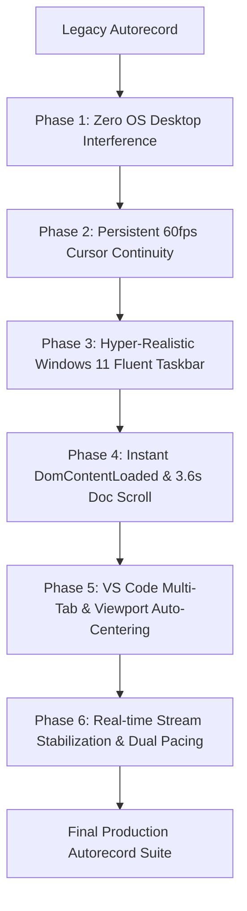

# Autorecord Suite: Direct Migration & Upgrade Playbook 🚀

> **Actionable Blueprint for AI Agents & Developers**  
> Use this guide to directly transform any legacy or previous version of the `autorecord/` recording engine into the final, production-grade version across any repository (CopilotKit, Agno, Angular, React, Next.js, LangGraph, FastAPI, etc.).

---

## 📑 Table of Contents

1. [Overview & Transformation Goals](#1-overview--transformation-goals)
2. [File-by-File Upgrade Blueprint](#2-file-by-file-upgrade-blueprint)
   - [File 1: `recorder/overlays/cursor.ts`](#file-1-recorderoverlayscursorts)
   - [File 2: `recorder/overlays/taskbar.ts`](#file-2-recorderoverlaystaskbarts)
   - [File 3: `recorder/ide/generator.ts`](#file-3-recorderidegeneratorts)
   - [File 4: `recorder/engine.ts`](#file-4-recorderenginets)
   - [File 5: `recorder/actions/index.ts` & Action Handlers](#file-5-recorderactionsindexts--action-handlers)
   - [File 6: `recorder/config.ts`](#file-6-recorderconfigts)
   - [File 7: `record-all-pages.ts`](#file-7-record-all-pagests)
3. [Summary of Architectural Upgrades](#3-summary-of-architectural-upgrades)
4. [Agent Verification Checklist](#4-agent-verification-checklist)

---

## 1. Overview & Transformation Goals

When upgrading an existing `autorecord/` suite from its initial implementation to the final architecture, apply these key transformations:

| Legacy Characteristic | Target Final State | Key Benefit |
|---|---|---|
| Spawns native OS VS Code desktop application | 100% browser-simulated VS Code Dark+ IDE | Zero desktop interference, works on CI/CD and any OS |
| Abrupt cuts / white-screen flashes between steps | Dark shield transition (`#0f172a`) + Windows 11 Taskbar app switching | Seamless cinematic visual transitions |
| Teleporting mouse cursor snapping to `(500, 300)` | Persistent coordinate tracking (`globalCursorX/Y`) | Continuous, unbroken 60fps cursor trajectory |
| Jittery doc scroll with 4–5s initial freeze | `domcontentloaded` + unified 3.6s cubic ease-in-out scroll (~90% depth) | Instant start, fluid and relaxed reading pace |
| Single-file IDE cuts and obscured offscreen code | In-place multi-tab switching (`#ide-tab-0/1`) + `humanScrollCodeViewport` | Clean tab transitions, code auto-centered |
| Static `sleep()` delays on AI responses | Dynamic token stability detection (`waitForAgentResponseCompletion`) | Never cuts off responses, eliminates dead wait air |
| Uniform sluggish wait times across all actions | **Dual Pacing Policy** (4.0s single-prompt / 1.5s multi-tab) | Brisk, energetic pacing during multi-step demos |
| Console error clutter from benign 404s & hydration | Smart filter for favicon, `.map`, and React dev hydration warnings | Clean, actionable terminal diagnostics |

---

## 2. File-by-File Upgrade Blueprint

---

### File 1: `recorder/overlays/cursor.ts`

#### What to Update:
1. **Persistent Coordinate State:** Export `getGlobalCursorPos()` and `setGlobalCursorPos()` to maintain continuous cursor position in memory across navigations.
2. **Practiced Bézier Cursor Physics:** Upgrade `humanGlide` with variable velocity easing ($t = 1 - (1-t)^{2.5}$) and 60fps event emission.
3. **Silky Ease-in-Out Doc Scroll:** Replace jittery wheel loops with unified 3600ms cubic ease-in-out scroll covering ~90% of page depth.

#### Target Implementation:
```typescript
import { type Page } from 'playwright';

let globalCursorX = 960;
let globalCursorY = 540;

export function getGlobalCursorPos(): { x: number; y: number } {
  return { x: globalCursorX, y: globalCursorY };
}

export function setGlobalCursorPos(x: number, y: number): void {
  globalCursorX = x;
  globalCursorY = y;
}

export async function sleep(ms: number): Promise<void> {
  return new Promise((resolve) => setTimeout(resolve, ms));
}

/**
 * Practiced human mouse glide with continuous 60fps Bézier motion
 */
export async function humanGlide(
  page: Page,
  targetX: number,
  targetY: number,
  customSteps?: number,
): Promise<void> {
  const currentPos = (await page.evaluate(`
    (function() {
      var c = document.getElementById('playwright-virtual-mouse');
      if (c && c.style.left && c.style.top) {
        return { x: parseFloat(c.style.left) || ${globalCursorX}, y: parseFloat(c.style.top) || ${globalCursorY} };
      }
      return { x: ${globalCursorX}, y: ${globalCursorY} };
    })()
  `)) as { x: number; y: number };

  const startX = currentPos.x;
  const startY = currentPos.y;
  const distance = Math.hypot(targetX - startX, targetY - startY);

  if (distance < 2) {
    setGlobalCursorPos(targetX, targetY);
    return;
  }

  const steps = customSteps ?? Math.min(26, Math.max(12, Math.floor(distance / 28)));
  const midX = (startX + targetX) / 2;
  const midY = (startY + targetY) / 2;
  const normalX = -(targetY - startY) / (distance || 1);
  const normalY = (targetX - startX) / (distance || 1);

  const maxCurvature = Math.min(30, distance * 0.12);
  const arcDirection = (targetX + targetY) % 2 === 0 ? 1 : -1;
  const curvature = arcDirection * (8 + Math.random() * maxCurvature);

  const cp1X = startX + (midX - startX) * 0.45 + normalX * curvature;
  const cp1Y = startY + (midY - startY) * 0.45 + normalY * curvature;
  const cp2X = midX + (targetX - midX) * 0.55 + normalX * (curvature * 0.6);
  const cp2Y = midY + (targetY - midY) * 0.55 + normalY * (curvature * 0.6);

  for (let i = 1; i <= steps; i++) {
    const rawT = i / steps;
    const t = 1 - Math.pow(1 - rawT, 2.5);

    const u = 1 - t;
    const tt = t * t;
    const uu = u * u;
    const uuu = uu * u;
    const ttt = tt * t;

    let cx = uuu * startX + 3 * uu * t * cp1X + 3 * u * tt * cp2X + ttt * targetX;
    let cy = uuu * startY + 3 * uu * t * cp1Y + 3 * u * tt * cp2Y + ttt * targetY;

    if (i > 1 && i < steps) {
      cx += (Math.random() - 0.5) * 0.35;
      cy += (Math.random() - 0.5) * 0.35;
    }

    await page.evaluate(`
      (function() {
        var c = document.getElementById('playwright-virtual-mouse');
        if (c) {
          c.style.left = "${cx.toFixed(1)}px";
          c.style.top = "${cy.toFixed(1)}px";
        }
      })()
    `);

    await page.mouse.move(cx, cy);
    await sleep(10 + Math.floor(Math.random() * 4));
  }

  await page.evaluate(`
    (function() {
      var c = document.getElementById('playwright-virtual-mouse');
      if (c) {
        c.style.left = "${targetX}px";
        c.style.top = "${targetY}px";
      }
    })()
  `);
  await page.mouse.move(targetX, targetY);
  setGlobalCursorPos(targetX, targetY);
  await sleep(40);
}

/** Practiced human click with crisp press & release */
export async function humanClick(page: Page): Promise<void> {
  await sleep(30);
  await page.evaluate(`
    (function() {
      var c = document.getElementById('playwright-virtual-mouse');
      if (c) c.style.transform = 'translate(-2px, -2px) scale(0.85)';
    })()
  `);
  await page.mouse.down();
  await sleep(55);
  await page.evaluate(`
    (function() {
      var c = document.getElementById('playwright-virtual-mouse');
      if (c) c.style.transform = 'translate(-2px, -2px) scale(1)';
    })()
  `);
  await page.mouse.up();
  await sleep(40);
}

/**
 * Smooth, natural human scroll down the documentation page (~85-90% depth)
 * Calibrated for a relaxed, 50% slower reading velocity (3.6s duration).
 */
export async function humanScrollDown(
  page: Page,
  totalPixels: number = 1800,
  durationMs: number = 3600,
): Promise<void> {
  const steps = 60;
  const interval = Math.max(25, Math.floor(durationMs / steps));
  let previousProgress = 0;

  for (let i = 1; i <= steps; i++) {
    const t = i / steps;
    const currentProgress =
      t < 0.5 ? 4 * t * t * t : 1 - Math.pow(-2 * t + 2, 3) / 2;
    const deltaY = Math.round((currentProgress - previousProgress) * totalPixels);
    previousProgress = currentProgress;

    if (deltaY > 0) {
      await page.mouse.wheel(0, deltaY);
      await page.evaluate((dy) => {
        window.scrollBy(0, dy);
        var scrollers = document.querySelectorAll(
          'main, article, [class*="overflow-y-auto"], [class*="content"], div[id*="content"]',
        );
        for (var j = 0; j < scrollers.length; j++) {
          var el = scrollers[j];
          if (el.scrollHeight > el.clientHeight) {
            el.scrollTop += dy;
          }
        }
      }, deltaY).catch(() => {});
    }

    await sleep(interval);
  }

  await sleep(300);
}
```

---

### File 2: `recorder/overlays/taskbar.ts`

#### What to Update:
1. **Acrylic / Mica Material:** Apply `rgba(28, 28, 32, 0.85)` background with `backdrop-filter: blur(36px) saturate(180%)`.
2. **Official Fluent Vector Icons:** Start 4-square, Search, Task View, Explorer, Chrome color-wheel, VS Code 3D ribbon, Terminal, Copilot.
3. **Mount Cursor at Active Coordinates:** Use `${curY}px, ${curX}px` so the cursor starts on the exact clicked taskbar icon on fresh page loads.
4. **Dynamic Coordinates:** Use `getBoundingClientRect()` in `clickTaskbarApp`.

#### Target Implementation:
```typescript
import { type Page } from 'playwright';
import { getGlobalCursorPos, humanClick, humanGlide, sleep } from './cursor';

export async function ensureOverlays(
  page: Page,
  activeApp: 'chrome' | 'vscode' = 'chrome',
): Promise<void> {
  const chromeInd = activeApp === 'chrome' ? '#60a5fa' : 'transparent';
  const vscodeInd = activeApp === 'vscode' ? '#60a5fa' : 'transparent';
  const { x: curX, y: curY } = getGlobalCursorPos();

  const code = `
    (function() {
      var elevateBadges = function() {
        var portals = document.querySelectorAll('nextjs-portal');
        for (var i = 0; i < portals.length; i++) {
          var p = portals[i];
          if (p.shadowRoot) {
            var ind = p.shadowRoot.querySelector('#devtools-indicator, [data-nextjs-toast]');
            if (ind) ind.style.bottom = '56px';
          }
        }
      };
      elevateBadges();
      setTimeout(elevateBadges, 500);

      var bar = document.getElementById('win11-taskbar-overlay');
      if (!bar) {
        bar = document.createElement('div');
        bar.id = 'win11-taskbar-overlay';
        bar.style.cssText = 'position:fixed!important;bottom:0!important;left:0!important;width:100vw!important;height:48px!important;background:rgba(28,28,32,0.85)!important;backdrop-filter:blur(36px) saturate(180%)!important;-webkit-backdrop-filter:blur(36px) saturate(180%)!important;border-top:1px solid rgba(255,255,255,0.08)!important;box-shadow:0 -1px 8px rgba(0,0,0,0.35)!important;z-index:2147483645!important;display:flex!important;align-items:center!important;justify-content:space-between!important;padding:0 8px 0 12px!important;box-sizing:border-box!important;font-family:"Segoe UI Variable Small","Segoe UI",-apple-system,BlinkMacSystemFont,Roboto,sans-serif!important;user-select:none!important;pointer-events:none!important;';

        bar.innerHTML = [
          // Left: Weather widget
          '<div style="display:flex;align-items:center;gap:8px;padding:3px 8px;border-radius:4px;background:rgba(255,255,255,0.03);border:1px solid rgba(255,255,255,0.04);cursor:default;">',
          '  <svg width="20" height="20" viewBox="0 0 24 24" fill="none"><circle cx="12" cy="12" r="4.5" fill="#f59e0b"/><path d="M12 2v2.5M12 19.5V22M4.93 4.93l1.77 1.77M17.3 17.3l1.77 1.77M2 12h2.5M19.5 12H22M4.93 19.07l1.77-1.77M17.3 6.7l1.77-1.77" stroke="#fbbf24" stroke-width="1.8" stroke-linecap="round"/></svg>',
          '  <div style="display:flex;flex-direction:column;line-height:1.1;"><span style="font-size:11.5px;font-weight:600;color:#f3f4f6;">76°F</span><span style="font-size:10px;color:#9ca3af;">Mostly Sunny</span></div>',
          '</div>',

          // Center: Taskbar App Icons
          '<div id="win11-taskbar-center-icons" style="display:flex;align-items:center;gap:3px;position:absolute;left:50%;transform:translateX(-50%);">',
          '  <div id="win11-taskbar-start" style="width:40px;height:40px;display:flex;align-items:center;justify-content:center;border-radius:5px;"><svg width="20" height="20" viewBox="0 0 24 24"><path fill="#0078d4" d="M3 3.5A.5.5 0 0 1 3.5 3h7a.5.5 0 0 1 .5.5v7a.5.5 0 0 1-.5.5h-7a.5.5 0 0 1-.5-.5v-7zm10 0a.5.5 0 0 1 .5-.5h7a.5.5 0 0 1 .5.5v7a.5.5 0 0 1-.5.5h-7a.5.5 0 0 1-.5-.5v-7zM3 13.5a.5.5 0 0 1 .5-.5h7a.5.5 0 0 1 .5.5v7a.5.5 0 0 1-.5.5h-7a.5.5 0 0 1-.5-.5v-7zm10 0a.5.5 0 0 1 .5-.5h7a.5.5 0 0 1 .5.5v7a.5.5 0 0 1-.5.5h-7a.5.5 0 0 1-.5-.5v-7z"/></svg></div>',
          '  <div id="win11-taskbar-search" style="width:40px;height:40px;display:flex;align-items:center;justify-content:center;border-radius:5px;"><svg width="18" height="18" viewBox="0 0 24 24" fill="none" stroke="#e5e7eb" stroke-width="2" stroke-linecap="round"><circle cx="11" cy="11" r="7"/><path d="m20 20-3.5-3.5"/></svg></div>',
          '  <div id="win11-taskbar-taskview" style="width:40px;height:40px;display:flex;align-items:center;justify-content:center;border-radius:5px;"><svg width="18" height="18" viewBox="0 0 24 24" fill="none"><rect x="3" y="4" width="10" height="12" rx="1.5" stroke="#e5e7eb" stroke-width="1.8"/><rect x="11" y="8" width="10" height="12" rx="1.5" fill="#ffffff" fill-opacity="0.2" stroke="#e5e7eb" stroke-width="1.8"/></svg></div>',
          '  <div id="win11-taskbar-explorer" style="width:40px;height:40px;display:flex;flex-direction:column;align-items:center;justify-content:center;border-radius:5px;position:relative;"><svg width="22" height="22" viewBox="0 0 24 24"><path fill="#0284c7" d="M4 4h6l2 2h8a2 2 0 0 1 2 2v2H2V6a2 2 0 0 1 2-2z"/><path fill="#facc15" d="M2 9h20v10a2 2 0 0 1-2 2H4a2 2 0 0 1-2-2V9z"/><path fill="#fde047" d="M2 11h20v8a2 2 0 0 1-2 2H4a2 2 0 0 1-2-2v-8z"/></svg><div style="position:absolute;bottom:2px;width:6px;height:3px;background:rgba(255,255,255,0.4);border-radius:2px;"></div></div>',
          '  <div id="win11-taskbar-chrome" style="width:40px;height:40px;display:flex;flex-direction:column;align-items:center;justify-content:center;position:relative;border-radius:5px;${activeApp === 'chrome' ? 'background:rgba(255,255,255,0.08);' : ''}"><svg width="23" height="23" viewBox="0 0 24 24"><circle cx="12" cy="12" r="10" fill="#ffffff"/><path fill="#ea4335" d="M12 2C6.48 2 2 6.48 2 12c0 .35.02.7.06 1.04l5.37-9.3C8.83 2.64 10.36 2 12 2z"/><path fill="#fbbc05" d="M22 12c0 5.52-4.48 10-10 10-1.64 0-3.17-.64-4.57-1.74l5.37-9.3c.34.04.69.06 1.04.06 4.5 0 8.16-3.66 8.16-8.16 0-.35-.02-.7-.06-1.04C21.98 11.3 22 11.65 22 12z"/><path fill="#34a853" d="M12 22C6.48 22 2 17.52 2 12c0-1.64.64-3.17 1.74-4.57l5.37 9.3c-.34-.04-.69-.06-1.04-.06 2.25 0 4.29.91 5.77 2.39L12 22z"/><circle cx="12" cy="12" r="4.3" fill="#ffffff"/><circle cx="12" cy="12" r="3.2" fill="#1a73e8"/></svg><div id="win11-chrome-indicator" style="position:absolute;bottom:2px;width:${activeApp === 'chrome' ? '16px' : '6px'};height:3px;background:${chromeInd || 'rgba(255,255,255,0.4)'};border-radius:2px;transition:all 0.2s ease;"></div></div>',
          '  <div id="win11-taskbar-vscode" style="width:40px;height:40px;display:flex;flex-direction:column;align-items:center;justify-content:center;position:relative;border-radius:5px;${activeApp === 'vscode' ? 'background:rgba(255,255,255,0.08);' : ''}"><svg width="23" height="23" viewBox="0 0 24 24"><path fill="#0065a9" d="M18.7 2.3 12.3 8.2 7.2 4.3 3.6 5.8v12.4l3.6 1.5 5.1-3.9 6.4 5.9 3.7-1.8V4.1l-3.7-1.8z"/><path fill="#007acc" d="m18.7 2.3-6.4 5.9 3.6 3.8 4.8-3.7 1.7.9V4.1l-3.7-1.8z"/><path fill="#1f9cf0" d="M18.7 21.7 12.3 15.8l3.6-3.8 4.8 3.7 1.7-.9v6.1l-3.7 1.8z"/><path fill="#0065a9" d="M7.2 4.3 3.6 5.8v12.4l3.6 1.5 8.7-7.7L7.2 4.3z"/><path fill="#ffffff" fill-opacity="0.18" d="m15.9 12-8.7-7.7v15.4L15.9 12z"/></svg><div id="win11-vscode-indicator" style="position:absolute;bottom:2px;width:${activeApp === 'vscode' ? '16px' : '6px'};height:3px;background:${vscodeInd || 'rgba(255,255,255,0.4)'};border-radius:2px;transition:all 0.2s ease;"></div></div>',
          '  <div id="win11-taskbar-notepad" style="width:40px;height:40px;display:flex;flex-direction:column;align-items:center;justify-content:center;position:relative;border-radius:5px;"><svg width="22" height="22" viewBox="0 0 24 24"><rect width="20" height="20" x="2" y="2" rx="3" fill="#0284c7"/><path fill="#ffffff" d="M6 7h12v1.5H6V7zm0 4h12v1.5H6V11zm0 4h8v1.5H6V15z"/></svg><div id="win11-notepad-indicator" style="position:absolute;bottom:2px;width:6px;height:3px;background:transparent;border-radius:2px;"></div></div>',
          '  <div id="win11-taskbar-terminal" style="width:40px;height:40px;display:flex;align-items:center;justify-content:center;border-radius:5px;"><svg width="22" height="22" viewBox="0 0 24 24"><rect width="22" height="22" x="1" y="1" rx="4" fill="#18181b" stroke="rgba(255,255,255,0.1)" stroke-width="1"/><path d="m6 8 4 4-4 4" stroke="#34d399" stroke-width="2" stroke-linecap="round" stroke-linejoin="round" fill="none"/><line x1="12" y1="16" x2="17" y2="16" stroke="#9ca3af" stroke-width="2" stroke-linecap="round"/></svg></div>',
          '  <div id="win11-taskbar-copilot" style="width:40px;height:40px;display:flex;align-items:center;justify-content:center;border-radius:5px;"><svg width="20" height="20" viewBox="0 0 24 24"><path fill="#0ea5e9" d="M12 2C6.48 2 2 6.48 2 12s4.48 10 10 10 10-4.48 10-10S17.52 2 12 2zm1 15h-2v-6h2v6zm0-8h-2V7h2v2z"/></svg></div>',
          '</div>',

          // Right: System Tray & Clock
          '<div style="display:flex;align-items:center;gap:6px;font-size:12px;color:#f3f4f6;">',
          '  <div style="width:26px;height:32px;display:flex;align-items:center;justify-content:center;"><svg width="14" height="14" viewBox="0 0 24 24" fill="none" stroke="#d1d5db" stroke-width="2.2" stroke-linecap="round"><path d="m18 15-6-6-6 6"/></svg></div>',
          '  <div style="padding:4px 6px;border-radius:4px;font-size:11px;font-weight:600;color:#e5e7eb;">ENG</div>',
          '  <div style="display:flex;align-items:center;gap:8px;padding:4px 8px;border-radius:4px;background:rgba(255,255,255,0.03);border:1px solid rgba(255,255,255,0.04);"><svg width="15" height="15" viewBox="0 0 24 24" fill="none" stroke="#e5e7eb" stroke-width="2" stroke-linecap="round"><path d="M5 12.55a11 11 0 0 1 14.08 0M1.42 9a16 16 0 0 1 21.16 0M8.53 16.11a6 6 0 0 1 6.95 0M12 20h.01"/></svg><svg width="15" height="15" viewBox="0 0 24 24" fill="none" stroke="#e5e7eb" stroke-width="2" stroke-linecap="round"><polygon points="11 5 6 9 2 9 2 15 6 15 11 19 11 5"/><path d="M15.54 8.46a5 5 0 0 1 0 7.07"/><path d="M19.07 4.93a10 10 0 0 1 0 14.14"/></svg><svg width="17" height="17" viewBox="0 0 24 24" fill="none" stroke="#e5e7eb" stroke-width="1.8"><rect x="2" y="7" width="17" height="10" rx="2"/><path d="M22 11v2" stroke-linecap="round"/><rect x="4" y="9" width="13" height="6" fill="#10b981" stroke="none" rx="1"/></svg></div>',
          '  <div style="display:flex;flex-direction:column;align-items:flex-end;line-height:1.15;padding:3px 6px;"><span id="win11-time" style="font-size:11.5px;font-weight:600;color:#f3f4f6;"></span><span id="win11-date" style="font-size:10px;color:#9ca3af;"></span></div>',
          '  <div style="width:28px;height:32px;display:flex;align-items:center;justify-content:center;"><svg width="15" height="15" viewBox="0 0 24 24" fill="none" stroke="#d1d5db" stroke-width="2" stroke-linecap="round"><path d="M18 8A6 6 0 0 0 6 8c0 7 3 9 3 9h18s-3-2-3-9"/><path d="M13.73 21a2 2 0 0 1-3.46 0"/></svg></div>',
          '  <div style="width:3px;height:24px;border-left:1px solid rgba(255,255,255,0.15);margin-left:2px;"></div>',
          '</div>'
        ].join('');

        document.documentElement.appendChild(bar);

        var tick = function() {
          var now = new Date();
          var timeEl = document.getElementById('win11-time');
          var dateEl = document.getElementById('win11-date');
          if (timeEl) timeEl.textContent = now.toLocaleTimeString([], { hour: 'numeric', minute: '2-digit', hour12: true });
          if (dateEl) dateEl.textContent = now.toLocaleDateString([], { month: 'numeric', day: 'numeric', year: 'numeric' });
        };
        tick();
        setInterval(tick, 1000);
      } else {
        var cTile = document.getElementById('win11-taskbar-chrome');
        var vTile = document.getElementById('win11-taskbar-vscode');
        var cInd = document.getElementById('win11-chrome-indicator');
        var vInd = document.getElementById('win11-vscode-indicator');
        if (cTile) cTile.style.backgroundColor = '${activeApp === 'chrome' ? 'rgba(255,255,255,0.08)' : 'transparent'}';
        if (vTile) vTile.style.backgroundColor = '${activeApp === 'vscode' ? 'rgba(255,255,255,0.08)' : 'transparent'}';
        if (cInd) {
          cInd.style.background = '${chromeInd || 'rgba(255,255,255,0.4)'}';
          cInd.style.width = '${activeApp === 'chrome' ? '16px' : '6px'}';
        }
        if (vInd) {
          vInd.style.background = '${vscodeInd || 'rgba(255,255,255,0.4)'}';
          vInd.style.width = '${activeApp === 'vscode' ? '16px' : '6px'}';
        }
      }

      // Virtual Mouse Cursor (mounted at real-time coordinates)
      var cursor = document.getElementById('playwright-virtual-mouse');
      if (!cursor) {
        cursor = document.createElement('div');
        cursor.id = 'playwright-virtual-mouse';
        cursor.style.cssText = 'position:fixed!important;top:${curY.toFixed(1)}px!important;left:${curX.toFixed(1)}px!important;width:24px!important;height:24px!important;z-index:2147483647!important;pointer-events:none!important;transform:translate(-2px,-2px)!important;transition:transform 0.04s ease-out!important;';
        cursor.innerHTML = '<svg width="24" height="24" viewBox="0 0 24 24" fill="none" style="filter:drop-shadow(0 2px 6px rgba(0,0,0,0.6));"><path d="M5.5 3.21V20.8c0 .45.54.67.85.35l4.86-4.86a.5.5 0 0 1 .35-.15h6.87c.45 0 .67-.54.35-.85L6.35 2.86a.5.5 0 0 0-.85.35Z" fill="#ffffff" stroke="#111111" stroke-width="1.5"/></svg>';
        document.documentElement.appendChild(cursor);
      }
    })();
  `;

  await page.evaluate(code);
}

export async function clickTaskbarApp(
  page: Page,
  targetApp: 'vscode' | 'chrome',
): Promise<void> {
  const targetId =
    targetApp === 'vscode' ? 'win11-taskbar-vscode' : 'win11-taskbar-chrome';

  const coords = (await page.evaluate(`
    (function() {
      var el = document.getElementById('${targetId}');
      if (el) {
        var rect = el.getBoundingClientRect();
        return { x: rect.left + rect.width / 2, y: rect.top + rect.height / 2 };
      }
      return {
        x: window.innerWidth / 2 + (${targetApp === 'vscode' ? 69 : 23}),
        y: window.innerHeight - 24,
      };
    })()
  `)) as { x: number; y: number };

  await humanGlide(page, coords.x, coords.y, 22);

  await page.evaluate(`
    (function() {
      var el = document.getElementById('${targetId}');
      if (el) el.style.backgroundColor = 'rgba(255, 255, 255, 0.08)';
    })()
  `);
  await sleep(150);

  await humanClick(page);

  await page.evaluate(`
    (function() {
      var cTile = document.getElementById('win11-taskbar-chrome');
      var vTile = document.getElementById('win11-taskbar-vscode');
      var cInd = document.getElementById('win11-chrome-indicator');
      var vInd = document.getElementById('win11-vscode-indicator');
      if ('${targetApp}' === 'vscode') {
        if (vTile) vTile.style.backgroundColor = 'rgba(255, 255, 255, 0.08)';
        if (cTile) cTile.style.backgroundColor = 'transparent';
        if (vInd) { vInd.style.background = '#60a5fa'; vInd.style.width = '16px'; }
        if (cInd) { cInd.style.background = 'rgba(255, 255, 255, 0.4)'; cInd.style.width = '6px'; }
      } else {
        if (cTile) cTile.style.backgroundColor = 'rgba(255, 255, 255, 0.08)';
        if (vTile) vTile.style.backgroundColor = 'transparent';
        if (cInd) { cInd.style.background = '#60a5fa'; cInd.style.width = '16px'; }
        if (vInd) { vInd.style.background = 'rgba(255, 255, 255, 0.4)'; vInd.style.width = '6px'; }
      }
    })()
  `);

  await sleep(400);
}
```

---

### File 3: `recorder/ide/generator.ts`

#### What to Update:
1. **Multi-Tab Signature:** Update `generateIdeHtml` to accept `extraTabs: IdeTabConfig[] = []` and `activeTabIdx = 0`.
2. **Tab Switcher Client Function:** Include `window.switchIdeTab(idx)` in the generated script so clicking `#ide-tab-1` switches files in place.
3. **Seti File Icons & Tokens:** Add TSX (`#3178c6`), Python (`#3776ab`), JSON (`#f59e0b`), Markdown (`#38bdf8`) icons.

#### Target Function Signature:
```typescript
export interface IdeTabConfig {
  filePath: string;
  startLine: number;
  endLine: number;
}

export function generateIdeHtml(
  rootDir: string,
  primaryFilePath: string,
  startLine = 1,
  endLine = 30,
  extraTabs: IdeTabConfig[] = [],
  activeTabIdx = 0,
): string { ... }
```

---

### File 4: `recorder/engine.ts`

#### What to Update:
1. **Reset Global Cursor Position:** Call `setGlobalCursorPos(960, 540)` at the start of `recordPage()`.
2. **Filter Hydration & Console Noise:** Filter `Hydration failed` and `server rendered text didn't match` in `page.on('pageerror')`.
3. **Step 1:** Instant `domcontentloaded` navigation $\rightarrow$ 500ms title pause $\rightarrow$ 3.6s continuous ~90% doc scroll $\rightarrow$ hover code $\rightarrow$ click VS Code.
4. **Step 2:** `humanScrollCodeViewport(page, config.startLine)` to auto-center code viewport for line numbers $> 14$.
5. **Step 3:** Dark shield body injection $\rightarrow$ `domcontentloaded` $\rightarrow$ action dispatch $\rightarrow$ stream stabilization $\rightarrow$ reading pause.

#### Target Snippets in `engine.ts`:
```typescript
// Auto-centering helper for code viewport
async function humanScrollCodeViewport(page: Page, startLine: number): Promise<void> {
  if (startLine <= 14) {
    await sleep(300);
    return;
  }
  const targetScrollTop = Math.max(0, (startLine - 8) * 22);
  await page.evaluate(async (targetY) => {
    const viewport = document.querySelector(
      '.editor-body-view:not([style*="display: none"]) .code-viewport, .code-viewport',
    ) as HTMLElement | null;
    if (!viewport) return;
    const startY = viewport.scrollTop;
    const distance = targetY - startY;
    if (Math.abs(distance) < 15) return;
    const steps = 32;
    for (let i = 1; i <= steps; i++) {
      const t = i / steps;
      const progress = t < 0.5 ? 4 * t * t * t : 1 - Math.pow(-2 * t + 2, 3) / 2;
      viewport.scrollTop = startY + distance * progress;
      await new Promise((r) => setTimeout(r, 20));
    }
  }, targetScrollTop);
  await sleep(350);
}
```

---

### File 5: `recorder/actions/index.ts` & Action Handlers

#### What to Update:
1. **Dynamic Stream Completion Detection:** Poll assistant message text until length stabilizes for 4 checks (1.6s).
2. **Dual Pacing Policy:**
   - Single-Prompt Actions: Pass `postWaitMs = 4000`.
   - Multi-Tab / Multi-Step Actions (`slots`, `prebuilt`, `runtime`, `programmatic`): Pass `postWaitMs = 1500`.

#### Target Implementation:
```typescript
export async function waitForAgentResponseCompletion(
  page: Page,
  postWaitMs = 4000,
): Promise<void> {
  console.log(`   ⏳ Actively detecting AI agent response start & streaming progress...`);

  let hasStarted = false;
  const startTime = Date.now();
  while (Date.now() - startTime < 30000) {
    const text = await page.evaluate(() => {
      const msgs = document.querySelectorAll(
        '.copilotKitAssistantMessage, [data-message-role="assistant"], .copilotKitMessage:not(:first-child), [class*="assistant"]'
      );
      if (msgs.length === 0) return '';
      const lastMsg = msgs[msgs.length - 1];
      return (lastMsg.textContent || '').trim();
    }).catch(() => '');

    if (text.length > 2) {
      hasStarted = true;
      break;
    }
    await sleep(300);
  }

  if (hasStarted) {
    console.log(`   🌊 AI agent is streaming response tokens...`);
    let previousText = '';
    let stableCount = 0;
    const streamStart = Date.now();

    while (Date.now() - streamStart < 45000) {
      const currentText = await page.evaluate(() => {
        const msgs = document.querySelectorAll(
          '.copilotKitAssistantMessage, [data-message-role="assistant"], .copilotKitMessage:not(:first-child), [class*="assistant"]'
        );
        if (msgs.length === 0) return '';
        const lastMsg = msgs[msgs.length - 1];
        return (lastMsg.textContent || '').trim();
      }).catch(() => '');

      if (currentText.length > 0 && currentText === previousText) {
        stableCount++;
        if (stableCount >= 4) {
          console.log(`   ✅ AI agent response completed (${currentText.length} characters).`);
          break;
        }
      } else {
        stableCount = 0;
        previousText = currentText;
      }
      await sleep(400);
    }
  }

  // Focus cursor on response
  const assistantLocator = page.locator(
    '.copilotKitAssistantMessage, [data-message-role="assistant"], .copilotKitMessage:not(:first-child)'
  ).last();
  if (await assistantLocator.isVisible({ timeout: 3000 }).catch(() => false)) {
    const abBox = await assistantLocator.boundingBox();
    if (abBox) {
      await humanGlide(page, abBox.x + Math.min(abBox.width / 2, 220), abBox.y + Math.min(abBox.height / 2, 60), 25);
    }
  }

  console.log(`   📖 Reading completed response (pausing ${postWaitMs / 1000}s)...`);
  await sleep(postWaitMs);
}
```

---

### File 6: `recorder/config.ts`

Set `waitAfterPromptMs: 4000` for standard pages, and `waitAfterPromptMs: 1500` for multi-tab pages (`prebuilt-components`, `slots`, `programmatic-control`, `inspector`, `copilot-runtime`).

---

### File 7: `record-all-pages.ts`

Add `--page=<id>` support and a final formatted status table report:
```bash
npm run record -- --page=quickstart
```

---

## 3. Summary of Architectural Upgrades



---

## 4. Agent Verification Checklist

When upgrading another repository with this guide, execute and verify:
- [ ] `npm run typecheck` exits with code `0`.
- [ ] Record a single-prompt page: `npm run record -- --page=quickstart` (verify 3.6s doc scroll, tab switch, 4s reading pause).
- [ ] Record a multi-tab page: `npm run record -- --page=slots` or `--page=prebuilt-components` (verify smooth in-editor code scroll, 1.5s tab pause).
- [ ] Verify exported videos in `autorecord/videos/*.webm` have zero cursor teleportation and zero white transition flashes.
