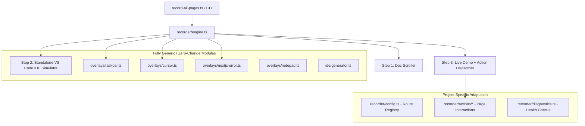

# Autorecording Suite — Project Porting & Integration Guide 🚀

This guide explains how to port and adapt this **3-step automated recording engine** (Official Doc $\rightarrow$ Standalone VS Code $\rightarrow$ Live Demo with interactive Taskbar, Human Cursor, Shadow DOM Piercing, Dynamic AI Response Detection, and Error Auto-Capture) into any other project.

---

## 🏗️ Architecture & Decoupling

The autorecord suite is designed around modular, plug-and-play layers:



---

## 📦 Step 1: Copying Files & Installation

1. Copy the entire `autorecord/` directory into your new project's root folder:

   ```
   my-new-project/
   ├── backend/
   ├── frontend/
   └── autorecord/
   ```

2. Inside `autorecord/package.json`, verify required dependencies:

   ```json
   {
     "name": "autorecord",
     "version": "1.0.0",
     "scripts": {
       "record": "tsx record-all-pages.ts"
     },
     "dependencies": {
       "playwright": "^1.49.0"
     },
     "devDependencies": {
       "@types/node": "^22.10.0",
       "tsx": "^4.19.0",
       "typescript": "^5.7.0"
     }
   }
   ```

3. Install dependencies and Chromium browser binary:
   ```bash
   cd autorecord
   npm install
   npx playwright install chromium
   ```

---

## ⚙️ Step 2: Adapting to Your Backend & Ports

Different frameworks use different ports and health check endpoints.

### 1. Update `recorder/diagnostics.ts`

Modify the backend/frontend URL targets to match your new project:

```typescript
// autorecord/recorder/diagnostics.ts
const FRONTEND_PORT = 3000;
const BACKEND_PORT = 8000; // Change to 8080, 5000, 3001 etc. if needed

export async function checkServicesHealth(): Promise<{
  frontend: boolean;
  backend: boolean;
}> {
  // Check Frontend (e.g. Next.js / Vite / Remix)
  const frontendOk = await checkPort(`http://localhost:${FRONTEND_PORT}`);

  // Check Backend (e.g. FastAPI / LangGraph / Express / AgentOS)
  const backendOk =
    (await checkPort(`http://localhost:${BACKEND_PORT}/health`)) ||
    (await checkPort(`http://localhost:${BACKEND_PORT}/agui`)) ||
    (await checkPort(`http://localhost:${BACKEND_PORT}/api/copilotkit`));

  return { frontend: frontendOk, backend: backendOk };
}
```

---

## 📋 Step 3: Registering Routes in `recorder/config.ts`

`recorder/config.ts` is the single source of truth for all recorded pages. Define each page with:

- `id`: Unique CLI identifier (used with `--page=<id>`).
- `title`: Clean feature title.
- `docUrl`: Official documentation link for Step 1.
- `demoUrl`: Local demo URL for Step 3 (`http://localhost:3000/...`).
- `ideFile`: Target source code file to highlight in Step 2.
- `startLine` & `endLine`: Snippet line range highlighted in VS Code.
- `actionType`: Name of the custom action handler (or `'chat'` for standard input).
- `waitAfterPromptMs`: Streaming wait time (increase for slower multi-agent LLM chains).

### Example Configuration:

```typescript
// autorecord/recorder/config.ts
export const PAGES_CONFIG: PageConfig[] = [
  {
    id: "quickstart",
    title: "Quickstart Chat",
    docUrl: "https://docs.yourproject.com/quickstart",
    demoUrl: "http://localhost:3000/quickstart/demo-chat",
    ideFile: "frontend/package.json",
    startLine: 12,
    endLine: 24,
    actionType: "chat",
    prompt: "Hello! Can you assist me with this task?",
    waitAfterPromptMs: 6000,
  },
  {
    id: "custom-tool",
    title: "Custom Agent Tool",
    docUrl: "https://docs.yourproject.com/tools",
    demoUrl: "http://localhost:3000/tools/demo-chat",
    ideFile: "frontend/src/app/tools/page.tsx",
    startLine: 35,
    endLine: 50,
    actionType: "custom-tool",
    prompt: "Check stock prices for AAPL",
    waitAfterPromptMs: 8000,
  },
];
```

---

## ⚡ Step 4: Next.js Hydration & Dev-Server Compilation Resilience

In Next.js development mode (App Router / Turbopack / Webpack), pages compile chunks on demand upon first navigation. If an automated script types immediately, React hydration can re-render and swallow input or lose event listeners.

The engine handles this automatically in Step 3 of [`recorder/engine.ts`](file:///c:/Users/dynamic%20computer/Desktop/work/FIQROS/optimized-malaika/agno/autorecord/recorder/engine.ts):

```typescript
// Step 3 Navigation in recorder/engine.ts
await page.goto(config.demoUrl, {
  waitUntil: 'load',
  timeout: 60000,
});
await ensureOverlays(page, 'chrome');

// Wait for Next.js compilation, network idle, and chat element mounting
await page.waitForLoadState('networkidle', { timeout: 8000 }).catch(() => {});
await page.waitForSelector(
  'textarea, input[type="text"], input, [contenteditable="true"], .copilotKitChat, [class*="copilotKit"]',
  { state: 'visible', timeout: 12000 }
).catch(() => {});
await sleep(1800);
```

And in action handlers, verify typed values and re-trigger submission if a re-render swallowed the enter key:

```typescript
// Ensure value is synchronized
const currentVal = await inputLocator.inputValue().catch(() => '');
if (!currentVal && config.prompt) {
  await inputLocator.fill(config.prompt);
  await sleep(300);
}
```

---

## 🎯 Step 5: Active Dynamic AI Response Detection

Rather than relying purely on static sleep timers, use `page.waitForFunction` to actively detect when assistant messages, streaming tokens, or generative cards mount in the DOM:

```typescript
console.log(`⏳ Actively detecting AI agent response...`);
await page.waitForFunction(
  () => {
    const assistantMsgs = document.querySelectorAll(
      '.copilotKitAssistantMessage, [data-message-role="assistant"], .copilotKitMessage:not(:first-child), [class*="assistant"]'
    );
    return assistantMsgs.length > 0;
  },
  { timeout: 18000 }
).catch(() => {});

await sleep(4000);

// Glide cursor smoothly over the rendered assistant message
const assistantLocator = page.locator('.copilotKitAssistantMessage, [data-message-role="assistant"]').first();
if (await assistantLocator.isVisible({ timeout: 4000 }).catch(() => false)) {
  const box = await assistantLocator.boundingBox();
  if (box) {
    await humanGlide(page, box.x + Math.min(box.width / 2, 200), box.y + 30, 25);
  }
}
```

---

## 🔍 Step 6: Piercing Shadow DOM Web Components (e.g. CopilotKit Inspector)

Modern overlays like `@copilotkit/web-inspector` mount inside `#shadow-root (open)`. Standard DOM queries will not pierce shadow roots without direct traversal.

Use `page.evaluate()` to query inside all active shadow roots:

```typescript
// Finding elements inside shadow DOM:
const targetPos = await page.evaluate(() => {
  for (const el of Array.from(document.querySelectorAll('*'))) {
    if (el.shadowRoot) {
      const target = Array.from(el.shadowRoot.querySelectorAll('button, a, [role="tab"], div, span')).find(
        (e) => (e.textContent || '').trim().toLowerCase() === 'agents'
      ) as HTMLElement;
      if (target) {
        target.click();
        const r = target.getBoundingClientRect();
        return { x: r.left + r.width / 2, y: r.top + r.height / 2 };
      }
    }
  }
  return null;
});

if (targetPos) {
  await humanGlide(page, targetPos.x, targetPos.y, 20);
  await humanClick(page);
}
```

---

## 📝 Step 7: Slide-up Notepad Notes for Architecture & Stubs

For features requiring architectural notes, database requirement explanations, or stub pages, use [`showNotepadNote`](file:///c:/Users/dynamic%20computer/Desktop/work/FIQROS/optimized-malaika/agno/autorecord/recorder/overlays/notepad.ts):

```typescript
import { showNotepadNote } from '../overlays/notepad';

await showNotepadNote(page, 'error_notice.txt', [
  'error : agno agent requires db , after adding sqlite this will work',
]);
```

This slides up an authentic Windows 11 Notepad window, clicks into the document, and simulates developer typing keystrokes with natural human jitter.

---

## 🚀 Running Your New Suite

```bash
# Record an individual feature
npm run record -- --page=quickstart

# Record all registered routes in batch
npm run record
```

All recorded videos will be saved to `autorecord/videos/` at **1080p, 60fps WebM**.

---

## 📋 5-Minute Porting Checklist

- [ ] Copied `autorecord/` into project root.
- [ ] Ran `npm install` and `npx playwright install chromium`.
- [ ] Verified frontend (`:3000`) and backend (`:8000`) ports in `recorder/diagnostics.ts`.
- [ ] Registered project routes, files, and line numbers in `recorder/config.ts`.
- [ ] Created action handlers in `recorder/actions/` with active response detection.
- [ ] Tested single page recording: `npm run record -- --page=<page_id>`.
