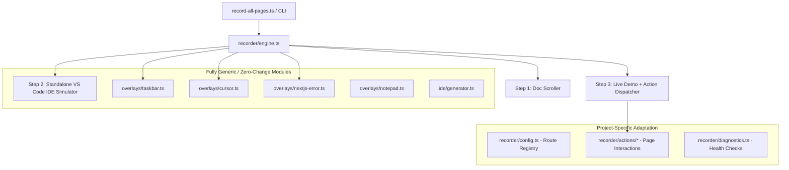

# Autorecording Suite — Project Porting & Integration Guide 🚀

This guide explains how to port and adapt this **3-step automated recording engine** (Official Doc $\rightarrow$ Standalone VS Code $\rightarrow$ Live Demo with interactive Taskbar, Human Cursor, Shadow DOM Piercing, Token Stream Completion Detection, and Error Auto-Capture) into any project.

---

## 🏗️ Architecture & Decoupling

The autorecord suite is designed around modular, plug-and-play layers:



---

## 📦 Step 1: Copying Files & Installation

1. Copy the entire `autorecord/` directory into your new project's root folder:

   ```
   my-new-project/
   ├── backend/
   ├── frontend/
   └── autorecord/
   ```

2. Inside `autorecord/package.json`, verify required dependencies:

   ```json
   {
     "name": "autorecord",
     "version": "1.0.0",
     "scripts": {
       "record": "tsx record-all-pages.ts"
     },
     "dependencies": {
       "playwright": "^1.49.0"
     },
     "devDependencies": {
       "@types/node": "^22.10.0",
       "tsx": "^4.19.0",
       "typescript": "^5.7.0"
     }
   }
   ```

3. Install dependencies and Chromium browser binary:
   ```bash
   cd autorecord
   npm install
   npx playwright install chromium
   ```

---

## ⚙️ Step 2: Adapting to Your Backend & Ports

Different frameworks use different ports and health check endpoints.

### Update `recorder/diagnostics.ts`

Modify the backend/frontend URL targets to match your new project:

```typescript
// autorecord/recorder/diagnostics.ts
const FRONTEND_PORT = 3000;
const BACKEND_PORT = 8000; // Change to 8080, 5000, 3001 etc. if needed

export async function checkServicesHealth(): Promise<{
  frontendOk: boolean;
  backendOk: boolean;
  frontendError?: string;
  backendError?: string;
}> {
  // Check Frontend (e.g. Next.js / Vite / Remix)
  const frontendHealth = await checkPort(`http://localhost:${FRONTEND_PORT}`);

  // Check Backend (e.g. FastAPI / LangGraph / Express / AgentOS)
  const backendHealth =
    (await checkPort(`http://localhost:${BACKEND_PORT}/health`)) ||
    (await checkPort(`http://localhost:${BACKEND_PORT}/agui`)) ||
    (await checkPort(`http://localhost:${BACKEND_PORT}/`));

  return {
    frontendOk: frontendHealth.ok,
    backendOk: backendHealth.ok,
    frontendError: frontendHealth.error,
    backendError: backendHealth.error,
  };
}
```

---

## 📋 Step 3: Registering Routes in `recorder/config.ts`

`recorder/config.ts` is the single source of truth for all recorded pages. Define each page with:

- `id`: Unique CLI identifier (used with `--page=<id>`).
- `name`: Clean feature title.
- `filename`: Exported video filename (e.g. `01-MSPY-react-Quickstart`).
- `docUrl`: Official documentation link for Step 1.
- `demoUrl`: Local demo URL for Step 3 (`http://localhost:3000/...`).
- `ideFile`: Target source code file to highlight in Step 2.
- `startLine` & `endLine`: Snippet line range highlighted in VS Code.
- `prompt`: User prompt typed in Step 3.
- `waitAfterPromptMs`: Reading pause duration after the response finishes streaming.

### Example Configuration:

```typescript
// autorecord/recorder/config.ts
export const PAGES: PageRecordConfig[] = [
  {
    id: 'quickstart',
    name: 'Quickstart',
    filename: '01-MSPY-react-Quickstart',
    docUrl: 'https://docs.copilotkit.ai/ms-agent-python/quickstart?agent=bring-your-own',
    ideFile: 'frontend/src/app/quickstart/demo-chat/page.tsx',
    startLine: 28,
    endLine: 38,
    demoUrl: 'http://localhost:3000/quickstart/demo-chat',
    prompt: 'Can you tell me a joke?',
    waitAfterPromptMs: 8000,
  },
  {
    id: 'interactive',
    name: 'Generative UI - Interactive Component',
    filename: '08-MSPY-react-Interactive',
    docUrl: 'https://docs.copilotkit.ai/ms-agent-python/generative-ui/your-components/interactive',
    ideFile: 'frontend/src/app/generative-ui/your-components/interactive/demo-chat/page.tsx',
    startLine: 23,
    endLine: 64,
    demoUrl: 'http://localhost:3000/generative-ui/your-components/interactive/demo-chat',
    prompt: 'Run the command rm -rf /tmp/cache',
    waitAfterPromptMs: 8000,
  },
];
```

---

## ⚡ Step 4: Next.js Hydration & Dev-Server Compilation Resilience

In development mode (Next.js App Router / Turbopack / Webpack), pages compile chunks on demand upon first navigation. If an automated script types immediately, React hydration can re-render and swallow input.

The engine handles this with fast `commit` navigation followed by explicit DOM readiness checks in [`recorder/engine.ts`](./recorder/engine.ts):

```typescript
// Step 3 Navigation in recorder/engine.ts
await page.goto(config.demoUrl, {
  waitUntil: 'commit',
  timeout: 45000,
});
await ensureOverlays(page, 'chrome');

// Wait for page body and chat element readiness
console.log(`   ⏳ Waiting for Next.js compilation & React hydration to settle...`);
await page.waitForSelector('body', { timeout: 10000 }).catch(() => {});
await page.waitForSelector(
  'textarea, input[type="text"], input, [contenteditable="true"], .copilotKitChat, [class*="copilotKit"]',
  { state: 'visible', timeout: 15000 },
).catch(() => {});
await sleep(1500);
```

And in action handlers, verify typed values and re-trigger submission if a re-render swallowed the enter key:

```typescript
// Verify input is populated; refill if React hydration wiped it during typing
const currentVal = await inputLocator.inputValue().catch(() => '');
if (!currentVal && config.prompt) {
  await inputLocator.fill(config.prompt);
  await sleep(300);
}
```

---

## 🎯 Step 5: Active Token Stream Stability & Response Completion Detection

Rather than relying on static timers or brittle spinner selectors, use text stability polling with `waitForAgentResponseCompletion`:

```typescript
export async function waitForAgentResponseCompletion(
  page: Page,
  postWaitMs = 6000,
): Promise<void> {
  console.log(`   ⏳ Actively detecting AI agent response start & streaming progress...`);

  // 1. Wait until assistant message starts receiving content
  let hasStarted = false;
  const startTime = Date.now();
  while (Date.now() - startTime < 30000) {
    const text = await page.evaluate(() => {
      const msgs = document.querySelectorAll(
        '.copilotKitAssistantMessage, [data-message-role="assistant"], .copilotKitMessage:not(:first-child), [class*="assistant"]'
      );
      if (msgs.length === 0) return '';
      const lastMsg = msgs[msgs.length - 1];
      return (lastMsg.textContent || '').trim();
    }).catch(() => '');

    if (text.length > 2) {
      hasStarted = true;
      break;
    }
    await sleep(400);
  }

  // 2. Poll until text length stabilizes (streaming tokens finished)
  if (hasStarted) {
    console.log(`   🌊 AI agent is streaming response tokens...`);
    let previousText = '';
    let stableCount = 0;
    const streamStart = Date.now();

    while (Date.now() - streamStart < 45000) {
      const currentText = await page.evaluate(() => {
        const msgs = document.querySelectorAll(
          '.copilotKitAssistantMessage, [data-message-role="assistant"], .copilotKitMessage:not(:first-child), [class*="assistant"]'
        );
        if (msgs.length === 0) return '';
        const lastMsg = msgs[msgs.length - 1];
        return (lastMsg.textContent || '').trim();
      }).catch(() => '');

      if (currentText.length > 0 && currentText === previousText) {
        stableCount++;
        // 4 consecutive stable checks (2 full seconds) means token streaming is 100% complete
        if (stableCount >= 4) {
          console.log(`   ✅ AI agent response completed (${currentText.length} characters).`);
          break;
        }
      } else {
        stableCount = 0;
        previousText = currentText;
      }
      await sleep(500);
    }
  }

  // 3. Glide cursor smoothly over the completed assistant response
  const assistantLocator = page.locator(
    '.copilotKitAssistantMessage, [data-message-role="assistant"], .copilotKitMessage:not(:first-child)'
  ).last();

  if (await assistantLocator.isVisible({ timeout: 3000 }).catch(() => false)) {
    const abBox = await assistantLocator.boundingBox();
    if (abBox) {
      await humanGlide(page, abBox.x + Math.min(abBox.width / 2, 220), abBox.y + Math.min(abBox.height / 2, 60), 25);
    }
  }

  // 4. Comfortable post-response reading pause
  console.log(`   📖 Reading completed response (pausing ${postWaitMs / 1000}s)...`);
  await sleep(postWaitMs);
}
```

---

## 🔍 Step 6: Piercing Shadow DOM Web Components (e.g. CopilotKit Inspector)

Modern overlays like `@copilotkit/web-inspector` mount inside `#shadow-root (open)`. Standard DOM queries will not pierce shadow roots without direct traversal.

Use `page.evaluate()` to query inside all active shadow roots:

```typescript
// Finding elements inside shadow DOM:
const targetPos = await page.evaluate(() => {
  for (const el of Array.from(document.querySelectorAll('*'))) {
    if (el.shadowRoot) {
      const target = Array.from(el.shadowRoot.querySelectorAll('button, a, [role="tab"], div, span')).find(
        (e) => (e.textContent || '').trim().toLowerCase() === 'agents'
      ) as HTMLElement;
      if (target) {
        target.click();
        const r = target.getBoundingClientRect();
        return { x: r.left + r.width / 2, y: r.top + r.height / 2 };
      }
    }
  }
  return null;
});

if (targetPos) {
  await humanGlide(page, targetPos.x, targetPos.y, 20);
  await humanClick(page);
}
```

---

## 📝 Step 7: Slide-up Notepad Notes for Architecture & Stubs

For features requiring architectural notes, database requirement explanations, or stub pages, use [`showNotepadNote`](./recorder/overlays/notepad.ts):

```typescript
import { showNotepadNote } from '../overlays/notepad';

await showNotepadNote(page, 'architecture_notice.txt', [
  'Note: Multi-agent routing requires AG-UI protocol endpoints active on :8000',
]);
```

This slides up an authentic Windows 11 Notepad window, clicks into the document, and simulates developer typing keystrokes with natural human jitter.

---

## 🚀 Running Your Suite

```bash
cd autorecord

# Record an individual feature
npm run record -- --page=quickstart
npm run record -- --page=interactive

# Record all registered routes in batch
npm run record
```

All recorded videos are saved to `autorecord/videos/` as **1080p, 60fps WebM** files with the configured filename (e.g. `MSPY-react-*.webm`).

---

## 📋 5-Minute Porting Checklist

- [ ] Copied `autorecord/` into project root.
- [ ] Ran `npm install` and `npx playwright install chromium` inside `autorecord/`.
- [ ] Verified frontend (`:3000`) and backend (`:8000`) ports in `recorder/diagnostics.ts`.
- [ ] Registered project routes, files, and line numbers in `recorder/config.ts`.
- [ ] Set `filename: 'MSPY-react-<FeatureName>'` for all target pages.
- [ ] Created action handlers in `recorder/actions/` using `waitForAgentResponseCompletion`.
- [ ] Tested single page recording: `npm run record -- --page=<page_id>`.
