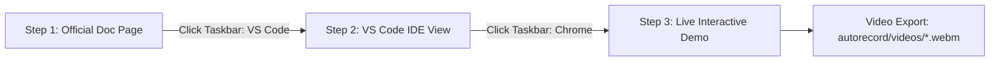

# CopilotKit + Microsoft Agent Framework (Python) Autorecording Suite 🎬

Automated, high-fidelity screen demonstration and video recording engine for the **CopilotKit + Microsoft Agent Framework (Python)** integration test harness.

---

## 📑 Table of Contents

- [Overview](#-overview)
- [3-Step Video Workflow](#-3-step-video-workflow)
- [Interactive Taskbar App-Switching](#-interactive-taskbar-app-switching)
- [Directory Structure](#-directory-structure)
- [Prerequisites & Getting Started](#-prerequisites--getting-started)
- [Usage & CLI Reference](#-usage--cli-reference)
- [Configured Pages & Route Mapping](#-configured-pages--route-mapping)
- [Architecture & Core Modules](#-architecture--core-modules)
  - [1. Standalone VS Code IDE Simulator](#1-standalone-vs-code-ide-simulator)
  - [2. Windows 11 Taskbar & App Switching Overlay](#2-windows-11-taskbar--app-switching-overlay)
  - [3. Tailored Action Handlers](#3-tailored-action-handlers)
- [Output Videos & Filename Conventions](#-output-videos--filename-conventions)
- [Troubleshooting & Diagnostics](#-troubleshooting--diagnostics)

---

## 🌟 Overview

The **Autorecord Suite** is a Playwright-powered recording pipeline designed to produce professional, human-like demonstration videos for documentation features, generative UI components, human-in-the-loop flows, agent routing, and runtime observability.

### Key Highlights:

- **Zero Black Screen & Instant Paint**: Navigates immediately via `domcontentloaded` without dead delay frames.
- **Hyper-Realistic Windows 11 Fluent Taskbar**: Authentic Acrylic/Mica blur (`rgba(28, 28, 32, 0.85)`, `blur(36px) saturate(180%)`), official vector SVGs (Start, Search, Task View, Explorer, Chrome, VS Code 3D ribbon, Terminal, Copilot), active 16px blue pill indicators (`#60a5fa`), live weather widget (`76°F Mostly Sunny`), and complete system tray.
- **Continuous Cross-Navigation Cursor Trajectory**: Persistent coordinate tracking across page navigations eliminates cursor teleportation—the mouse naturally glides from the exact taskbar icon clicked into the next view.
- **Relaxed Human Doc Scrolling**: Continuous eased scroll to ~75% of page depth across 3.2 seconds at a reading pace. Exactly one scroller is driven per tick — sending a wheel event *and* nudging `scrollTop` double-counts the travel and was the source of the old overscroll bounce.
- **100% Pure VS Code Simulation & Multi-Tab Support**: Step 2 renders code directly via a standalone HTML/CSS generator with Command Palette (`Ctrl + P`), Seti SVG icons, blinking caret, minimap, automatic `.code-viewport` snippet centering, and in-place multi-tab switching (`package.json` $\rightarrow$ `page.tsx`).
- **Real-Time Token Stream Completion Detection & Dual Pacing**: Dynamically observes the assistant message DOM until streaming stabilizes, applying a standard 4.0s pause for single-prompt pages and a brisk 1.5s pause for multi-tab/sequential demos.
- **Next.js Hydration & Dev-Server Compilation Synchronization**: Waits for DOM readiness and component readiness before dispatching actions, with automatic retry logic.
- **Shadow DOM Piercing for Web Inspector**: Automatically queries inside Web Component shadow roots to open the CopilotKit DevConsole and navigate between Threads, Agents, and Learning tabs.
- **Pre-flight Gate**: Confirms Next.js (`http://localhost:3000`) and the Agent Framework FastAPI service (`http://localhost:8000/health`) both answer, and **aborts before launching a browser** if either does not. `--force` overrides.
- **Honest Pass/Fail**: A 404 route, a chat surface that never renders, or an agent that never answers fails the run and exits 1. Only an unreachable *external doc page* degrades to a warning, since that is not the thing under test.

---

## 🎬 3-Step Video Workflow

Every recorded video follows a consistent, high-production 3-step sequence:



1. **Step 1 — Official Documentation View**:
   - Opens the official documentation URL immediately via `domcontentloaded`.
   - Pauses for **500ms** on the header, then eases down to ~75% of page depth over 3.2s — clamped so it never bottoms out into the footer.
   - Dynamically identifies the visible code snippet in the viewport, glides the virtual cursor over it, and pauses for a 2.0s reading window.
   - Glides cursor down to the simulated Windows 11 Taskbar, clicks the **VS Code** icon, and illuminates the blue active indicator (`#60a5fa`).

2. **Step 2 — Visual Studio Code IDE View**:
   - Renders an authentic simulated VS Code Dark+ IDE with Command Palette (`Ctrl + P`), Seti SVG file icons, blinking line caret, and minimap.
   - Supports in-place **multi-tab rendering**: For quickstart, displays `package.json` (lines 12–22), smoothly glides cursor to the `page.tsx` tab in the tab bar, clicks it, and switches to `page.tsx` (lines 28–38).
   - Automatically centers `.code-viewport` on the active snippet lines regardless of line depth.
   - Glides cursor down to the Taskbar and clicks the **Chrome** icon (illuminating its blue indicator).

3. **Step 3 — Live Interactive Demo**:
   - Navigates directly to the demo endpoint (`http://localhost:3000/<route>/demo-chat`) with zero transition flicker (dark background shield).
   - Injects the simulated Windows 11 Taskbar with live clock and active app indicators.
   - Types test prompts with snappy human keystrokes (30ms) and actively tracks token streaming in real-time until completion.
   - Applies the **Dual Pacing Policy**: Pauses for **4.0 seconds** on single-prompt pages, or **1.5 seconds** between sequential tabs/prompts (`slots`, `prebuilt-components`, `runtime`).

---

## 🖥️ Interactive Taskbar App-Switching

Rather than abrupt URL jumps, transitions between steps simulate natural desktop multitasking:

- **Switching from Doc $\rightarrow$ VS Code**: The virtual mouse glides down to `#win11-taskbar-vscode`, hovers with a translucent highlight (`rgba(255,255,255,0.08)`), clicks the icon, illuminates the blue active glow bar underneath VS Code, and transitions to the IDE.
- **Switching from VS Code $\rightarrow$ Live Demo**: The cursor glides down to `#win11-taskbar-chrome`, clicks the Chrome icon, illuminates the blue active glow bar underneath Chrome, and transitions to the live demo.

---

## 📂 Directory Structure

```
autorecord/
├── record-all-pages.ts        # CLI entrypoint & batch runner with summary report
├── README.md                  # How to run this suite (this file)
├── PORTING_GUIDE.md           # How to port it to another framework repo
├── package.json               # Node.js dependencies (Playwright, Shiki, tsx)
├── tsconfig.json              # TypeScript compilation configuration
├── videos/                    # Output directory for exported WebM videos
│   ├── MSPY-react-01-Quickstart.webm
│   └── ...
└── recorder/
    ├── README.md              # Recorder module architecture reference
    ├── types.ts               # TypeScript interfaces & configuration schemas
    ├── config.ts              # Page registry with 17 routes, file paths & line numbers
    ├── engine.ts              # Playwright browser lifecycle manager & recording coordinator
    ├── diagnostics.ts         # Pre-flight service health checks & error pattern matcher
    ├── ide/
    │   └── generator.ts       # VS Code Dark+ simulator; Shiki-highlighted, read from disk
    ├── overlays/
    │   ├── taskbar.ts         # Windows 11 Taskbar simulation overlay & app switching
    │   ├── cursor.ts          # Virtual mouse physics, Bézier easing & scroll helpers
    │   └── notepad.ts         # Notepad note simulator — UNUSED, not wired into any step
    └── actions/
        ├── prebuilt.action.ts       # Tab switching: CopilotChat -> CopilotSidebar -> CopilotPopup
        ├── programmatic.action.ts   # Dark Mode state toggle & copilotkit.runAgent execution
        ├── slots.action.ts          # Slot customization: Level 1 -> Level 2 -> Level 3 tabs
        ├── headless-ui.action.ts    # Custom headless chat input & response observation
        ├── inspector.action.ts      # CopilotKit Inspector overlay toggle & agents tab
        ├── hitl.action.ts           # Human-in-the-loop approval gate (Approve / Deny)
        ├── frontend-tools.action.ts # sayHello client-side browser execution & alert handling
        ├── shared-state.action.ts   # Language state read & toggle + re-run write
        ├── agent-app-context.action.ts # Colleagues readables context sharing
        ├── auth.action.ts           # Bearer token authentication status inspection
        ├── runtime.action.ts        # Multi-agent routing: my_agent vs sample_agent vs search_agent
        ├── ag-ui.action.ts          # Live AG-UI SSE protocol event log showcase
        ├── display-only.action.ts   # WeatherCard generative UI rendering
        ├── tool-rendering.action.ts # Named get_weather card + wildcard fallback
        ├── state-rendering.action.ts# Searches state list streaming from search_agent
        └── index.ts                 # Action dispatcher with standard chat fallback
```

---

## ⚡ Prerequisites & Getting Started

### 1. Start the Microsoft Agent Framework Backend

```bash
cd backend
uv run --prerelease=allow main.py
```

_Backend runs on `http://localhost:8000` exposing the AG-UI SSE endpoints at `/`, `/sample_agent`, and `/search_agent`._

### 2. Start the Next.js Frontend

```bash
cd frontend
npm run dev
```

_Frontend runs on `http://localhost:3000`._

### 3. Install Autorecord Dependencies (First Time Only)

```bash
cd autorecord
npm install
npx playwright install chromium
```

---

## 🚀 Usage & CLI Reference

Every command works from `autorecord/` **or** from the repo root — the root
`package.json` forwards `record`, `record:all`, `record:quickstart` and
`record:list` through to this package.

### Flags

| Flag | Effect |
|---|---|
| `--list`, `-l`, `--help` | Print every registered route with its doc URL, demo URL and source range, then exit. |
| `--page=<id>` / `--page <id>` | Record exactly one route. |
| `--<id>` | Shorthand for the same thing — `--quickstart`, `--slots`, `--ag-ui`. |
| `<id>` | Positional form — `npm run record quickstart`. |
| `--filter=<query>` | Record every route whose id or name contains `<query>`. |
| `--force` | Record even when the pre-flight health check fails. |

### Pre-flight gate

Before any browser launches, the runner checks that the frontend (`:3000`) and
the backend (`:8000`) both answer. If either is down it prints what to start and
**exits 1** without recording — a video of a dead page is worse than no video.
`--force` overrides. Override the URLs with `FRONTEND_URL` / `BACKEND_URL`.

### Reading the summary

```
   ✅ [PASS]  (24.1s) Quickstart -> MSPY-react-01-Quickstart.webm
   ⚠️  [PASS*] (31.7s) Inspector -> MSPY-react-06-Inspector.webm
        · Doc page (https://…/inspector): ℹ️ [Diagnostic Note]: Timeout 25000ms exceeded
   ❌ [FAIL]  (19.4s) AG-UI -> MSPY-react-17-AgUi.webm
        · Demo step failed: Agent never produced a response within 30s
```

- **PASS** — every step completed.
- **PASS\*** — recorded fine, but the external doc page misbehaved. The intro
  footage is degraded; the feature under test is not implicated.
- **FAIL** — the demo route 404'd, never rendered an interactive surface, the
  agent never answered, or the IDE view could not be built. The process exits 1,
  so this is safe to gate CI on.

### Record an Individual Feature Page (`--page=<id>`)

Pass the `--page=<id>` flag to record any specific route.

```bash
# 1. Quickstart demo (with package.json -> page.tsx tab switching)
npm run record -- --page=quickstart

# 2. Prebuilt Components
npm run record -- --page=prebuilt-components

# 3. Custom Look and Feel - Slots
npm run record -- --page=slots

# 4. Custom Look and Feel - Headless UI
npm run record -- --page=headless-ui

# 5. Custom Look and Feel - Programmatic Control
npm run record -- --page=programmatic-control

# 6. Custom Look and Feel - Inspector
npm run record -- --page=inspector

# 7. Generative UI - Display Only Component
npm run record -- --page=display-only

# 8. Generative UI - Interactive Component (Approval Gate)
npm run record -- --page=interactive

# 9. Generative UI - Tool Rendering
npm run record -- --page=tool-rendering

# 10. Generative UI - State Rendering
npm run record -- --page=state-rendering

# 11. App Control - Frontend Tools
npm run record -- --page=frontend-tools

# 12. Shared State - In-App Agent Read
npm run record -- --page=in-app-agent-read

# 13. Shared State - In-App Agent Write
npm run record -- --page=in-app-agent-write

# 14. Readables - Agent App Context
npm run record -- --page=agent-app-context

# 15. Authentication - Bearer Token
npm run record -- --page=auth

# 16. Backend - Copilot Runtime
npm run record -- --page=copilot-runtime

# 17. Backend - AG-UI Protocol Stream
npm run record -- --page=ag-ui
```

### Record Subsets with Filtering (`--filter=<query>`)

```bash
# Record only Generative UI pages
npm run record -- --filter=generative-ui

# Record Shared State pages
npm run record -- --filter=shared-state
```

### Record All Pages Sequentially

Run without arguments to record all 17 configured pages in batch mode:

```bash
npm run record
```

---

## 📋 Configured Pages & Route Mapping

All 17 active demo routes in `frontend/src/lib/nav-config.ts` are mapped with accurate source files and line ranges:

| Page ID | Video Output Filename | Route URL | Target Source File | Highlighted Lines |
|---|---|---|---|---|
| `quickstart` | `MSPY-react-01-Quickstart.webm` | `/quickstart/demo-chat` | `frontend/package.json` + `quickstart/demo-chat/page.tsx` | 12–22 & 28–38 |
| `prebuilt-components` | `MSPY-react-02-PrebuiltComponents.webm` | `/prebuilt-components/demo-chat` | `frontend/src/app/prebuilt-components/demo-chat/page.tsx` | 58–104 |
| `slots` | `MSPY-react-03-Slots.webm` | `/custom-look-and-feel/slots/demo-chat` | `frontend/src/app/custom-look-and-feel/slots/demo-chat/page.tsx` | 66–116 |
| `headless-ui` | `MSPY-react-04-HeadlessUI.webm` | `/custom-look-and-feel/headless-ui/demo-chat` | `frontend/src/app/custom-look-and-feel/headless-ui/demo-chat/page.tsx` | 28–78 |
| `programmatic-control` | `MSPY-react-05-ProgrammaticControl.webm` | `/programmatic-control/demo-chat` | `frontend/src/app/programmatic-control/demo-chat/page.tsx` | 28–102 |
| `inspector` | `MSPY-react-06-Inspector.webm` | `/inspector/demo-chat` | `frontend/src/components/providers.tsx` | 30–47 |
| `display-only` | `MSPY-react-07-DisplayOnly.webm` | `/generative-ui/your-components/display-only/demo-chat` | `frontend/src/app/generative-ui/your-components/display-only/demo-chat/page.tsx` | 27–55 |
| `interactive` | `MSPY-react-08-Interactive.webm` | `/generative-ui/your-components/interactive/demo-chat` | `frontend/src/app/generative-ui/your-components/interactive/demo-chat/page.tsx` | 23–64 |
| `tool-rendering` | `MSPY-react-09-ToolRendering.webm` | `/generative-ui/tool-rendering/demo-chat` | `frontend/src/app/generative-ui/tool-rendering/demo-chat/page.tsx` | 23–63 |
| `state-rendering` | `MSPY-react-10-StateRendering.webm` | `/generative-ui/state-rendering/demo-chat` | `frontend/src/app/generative-ui/state-rendering/demo-chat/page.tsx` | 28–53 |
| `frontend-tools` | `MSPY-react-11-FrontendTools.webm` | `/frontend-tools/demo-chat` | `frontend/src/app/frontend-tools/demo-chat/page.tsx` | 20–33 |
| `in-app-agent-read` | `MSPY-react-12-SharedStateRead.webm` | `/shared-state/in-app-agent-read/demo-chat` | `frontend/src/app/shared-state/in-app-agent-read/demo-chat/page.tsx` | 20–55 |
| `in-app-agent-write` | `MSPY-react-13-SharedStateWrite.webm` | `/shared-state/in-app-agent-write/demo-chat` | `frontend/src/app/shared-state/in-app-agent-write/demo-chat/page.tsx` | 30–54 |
| `agent-app-context` | `MSPY-react-14-AgentAppContext.webm` | `/agent-app-context/demo-chat` | `frontend/src/app/agent-app-context/demo-chat/page.tsx` | 18–34 |
| `auth` | `MSPY-react-15-Auth.webm` | `/auth/demo-chat` | `backend/main.py` | 66–90 |
| `copilot-runtime` | `MSPY-react-16-CopilotRuntime.webm` | `/copilot-runtime/demo-chat` | `frontend/src/app/api/copilotkit/route.ts` | 20–43 |
| `ag-ui` | `MSPY-react-17-AgUi.webm` | `/ag-ui/demo-chat` | `frontend/src/app/ag-ui/demo-chat/page.tsx` | 70–102 |

---

## 🛠️ Architecture & Core Modules

### 1. Standalone VS Code IDE Simulator

- **Location**: `autorecord/recorder/ide/generator.ts`
- Generates an isolated HTML/CSS page from local project files, syntax-highlighted with [Shiki](https://shiki.style) (`dark-plus`), and swaps it in via `document.open()/write()/close()`. Replacing the DOM in place — rather than navigating — is what removes the unload flash and the scroll-to-top jump.
- Completely decouples the IDE view from Next.js, guaranteeing zero dev badges or floating inspectors on Step 2.

### 2. Windows 11 Taskbar & App Switching Overlay

- **Location**: `autorecord/recorder/overlays/taskbar.ts`
- Injects the simulated Windows 11 Taskbar and coordinates animated icon clicks (`clickTaskbarApp`) to transition between Step 1 (Doc) $\rightarrow$ Step 2 (VS Code) $\rightarrow$ Step 3 (Chrome).
- Automatically elevates the Next.js dev portal above the 48px taskbar.

### 3. Tailored Action Handlers

- **Location**: `autorecord/recorder/actions/`
- Handlers specialize in unique page interactions:
  - `hitl.action.ts`: Waits for `humanApprovedCommand` card in the stream, glides cursor over "Approve", and clicks it.
  - `programmatic.action.ts`: Clicks "Dark Mode" to update `agent.state`, writes a draft message, and triggers `copilotkit.runAgent`.
  - `slots.action.ts`: Cycles through Level 1 (Tailwind), Level 2 (Props override), and Level 3 (Custom component), dispatching prompts.
  - `inspector.action.ts`: Pierces the Web Inspector Shadow DOM, opens the DevConsole, and navigates to the Agents tab.
  - `headless-ui.action.ts`: Focuses the custom headless input, types prompts, submits, and tracks assistant response bubbles.
  - `display-only.action.ts`: Exercises `useComponent` and tracks rendered `WeatherCard`.
  - `tool-rendering.action.ts`: Triggers named `get_weather` card with dynamic response detection.
  - `state-rendering.action.ts`: Streams `searches` state from `search_agent` and highlights live checkmarks.
  - `shared-state.action.ts`: Exercises `sample_agent` language state reading and `agent.setState` toggle + re-run.
  - `agent-app-context.action.ts`: Shares colleagues list context and verifies agent answers.
  - `auth.action.ts`: Highlights auth configuration verdict and sends verification prompt.
  - `runtime.action.ts`: Tests `my_agent`, switches to `sample_agent`, then to `search_agent`.
  - `ag-ui.action.ts`: Sends a query and hovers over live SSE event logs (`RunStarted`, `TextMessageContent`, `ToolCall`, `RunFinished`).

---

## 🎥 Output Videos & Filename Conventions

All recorded videos are saved to:

```
autorecord/videos/
```

- Resolution: **1920 × 1080 (1080p Full HD)**
- Framerate: **~25 FPS** — Playwright's capture rate, which is not configurable. Cursor and scroll easing are driven at ~60 events/sec, so motion still reads as smooth at that capture rate.
- Format: **WebM** (`VP8` / `VP9` codec)
- Filename pattern: `MSPY-react-<NN>-<FeatureName>.webm` — the index keeps the directory sorted in doc-nav order (set per page via `filename` in `recorder/config.ts`)

---

## ❓ Troubleshooting & Diagnostics

### 1. `Pre-flight Service Diagnostics: Microsoft Agent Framework Backend is unreachable`

- **Cause**: The Python FastAPI server on port 8000 is not running.
- **Fix**: Run `cd backend && uv run --prerelease=allow main.py`.

### 2. `Pre-flight Service Diagnostics: Next.js Frontend is unreachable`

- **Cause**: The Next.js dev server on port 3000 is not running.
- **Fix**: Run `cd frontend && npm run dev`.

### 3. AI response streaming takes longer than default timeout

- **Fix**: Increase `waitAfterPromptMs` in `autorecord/recorder/config.ts` for that page (e.g. `waitAfterPromptMs: 12000`).
